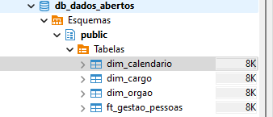

# Bem-vindo à Documentação do Projeto ETL Python - Dados Abertos Governo Federal - Gestão de Pessoas

## Introdução

Este projeto tem como objetivo extrair, transformar e carregar dados dos links do Portal de Dados Abertos do Governo Federal para o banco de dados do projeto ETL Python - Dados Abertos Governo Federal - Gestão de Pessoas.
Este é o link fonte com todos os dados em formato .ods: [Portal de Dados Abertos do Governo Federal - Gestão de Pessoas](https://dados.gov.br/dados/conjuntos-dados/gestao-de-pessoas-executivo-federal---cargos-vagos-e-vacancias)

## Modelagem de Dados

Para este projeto, utilizarei o banco de dados PostgreSQL estanciado no site render.com

Essa será a estrutura do banco de dados, modelagem star schema simples:

## Tecnologias Utilizadas

- Python
- PostgreSQL
- Power BI (para aplicação dos Kpis)

## Observações Finais

O projeto ainda está em desenvolvimento, e os dados do Portal de Dados Abertos do Governo Federal estão sendo atualizados constantemente, logo, é importante manter o projeto atualizado para não perder dados importantes.
Além disso, são diversos arquivos ods em links de períodos diferentes, logo preciso analisar se crio somente um etl para todos os dados ou faço um etl para cada período.

## Passos do Projeto

1. Estruturação do projeto - OK
2. Modelagem do DW, criação das tabelas no banco de dados PostgreSQL - OK

