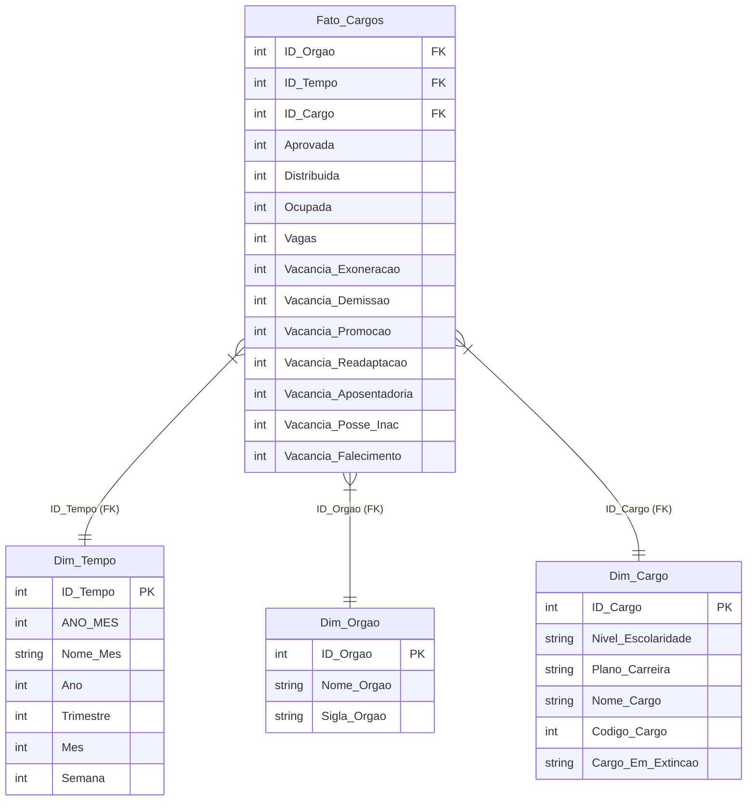
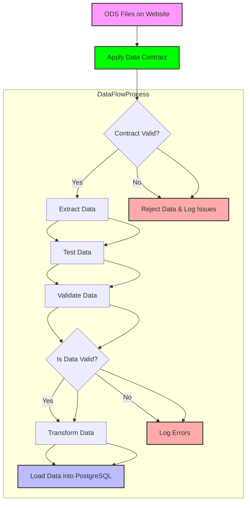

# Bem-vindo à Documentação do Projeto ETL Python - Dados Abertos Governo Federal - Gestão de Pessoas

## Introdução

Este projeto tem como objetivo extrair, transformar e carregar dados dos links do Portal de Dados Abertos do Governo Federal para o banco de dados do projeto ETL Python - Dados Abertos Governo Federal - Gestão de Pessoas.
Este é o link fonte com todos os dados em formato .ods: [Portal de Dados Abertos do Governo Federal - Gestão de Pessoas](https://dados.gov.br/dados/conjuntos-dados/gestao-de-pessoas-executivo-federal---cargos-vagos-e-vacancias)

## Modelagem de Dados

Para este projeto, utilizarei o banco de dados PostgreSQL estanciado no site render.com

Essa será a estrutura do banco de dados, modelagem star schema simples:



## Tecnologias Utilizadas

- Python
- PostgreSQL
- Power BI

Obs: Todas as tecnologias citadas acima são de código aberto, onde o custo para o projeto tende a ser mínimo.

## Fluxo de Dados



## Observações Finais

O projeto ainda está em desenvolvimento, e os dados do Portal de Dados Abertos do Governo Federal estão sendo atualizados constantemente, logo, é importante manter o projeto atualizado para não perder dados importantes.
Além disso, são diversos arquivos ods em links de períodos diferentes, logo preciso analisar se crio somente um etl para todos os dados ou faço um etl para cada período.

## Códigos de criação das tabelas no banco de dados

### Dimensões

```sql
-- Conteúdo do arquivo create_table_dim_calendario.sql
```

```sql
-- Conteúdo do arquivo create_table_dim_orgao.sql
```

```sql
-- Conteúdo do arquivo create_table_dim_cargo.sql
```

### Fato

```sql
-- Conteúdo do arquivo create_table_ft_cargo.sql
```
